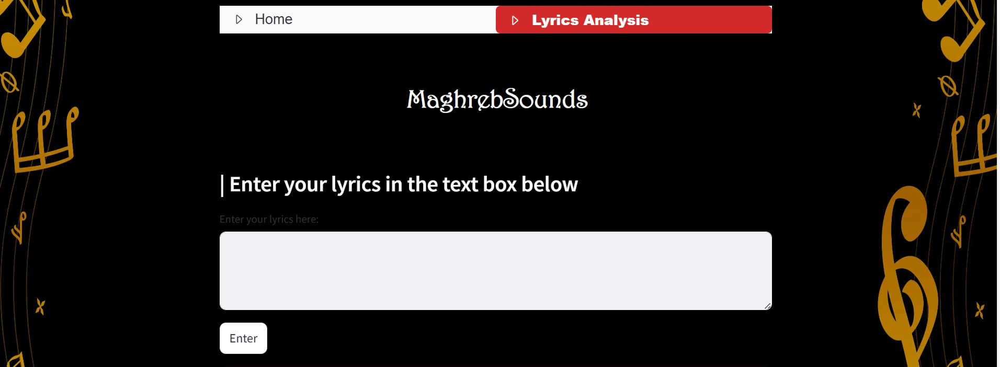

# Moroccan-Algerian-Tunisian Lyrics Classification

## Overview

This project focuses on web scraping lyrics from various websites, specifically targeting Moroccan, Algerian, and Tunisian songs. The collected data is then meticulously analyzed and classified based on dialect using advanced natural language processing techniques, including sentiment analysis.

## Dialect Statistics

- **Moroccan (0):** 176 songs
- **Tunisian (1):** 96 songs
- **Algerian (2):** 367 songs

## Preprocessing Phase

The collected lyrics undergo a rigorous preprocessing phase to ensure the quality of the analysis. The following techniques are applied:

- **Stopword Removal:** Common words that do not contribute significant meaning are eliminated to improve the accuracy of the analysis.
- **Tokenization:** The text is broken down into individual words or phrases to facilitate further analysis.
- **Stemming:** Words are reduced to their root form using techniques like Snowball Stemmer, ensuring consistency in word representation.
- **Language Detection:** The langdetect library is employed to accurately identify the language of the lyrics, ensuring appropriate processing for each dialect.
- **Farasa Segmentation:** The Farasa Segmenter is utilized for Arabic text segmentation, enhancing the understanding of the linguistic structure.

## Feature Extraction

Various methods are employed to extract meaningful features from the lyrics:

- **POS Tagging:** Parts of speech tagging is applied to understand the grammatical structure of the lyrics, providing insights into the role each word plays.
- **Tokenization:** Breaking down lyrics into tokens allows for a more granular analysis, capturing nuances in meaning.
- **Word2Vec:** Embedding words into vector representations enables semantic analysis, capturing relationships and meanings in the lyrics.
- **TF-IDF:** Using TfidfVectorizer, term frequency-inverse document frequency analysis is performed, highlighting the importance of words in the context of the entire dataset.
- **N-gram Analysis:** Exploration of the frequency and co-occurrence of word sequences provides insights into contextual patterns within the lyrics.

## Classification Models

A variety of classification models are employed to categorize the lyrics:

- **Transformers:** The language model (CAMeL-Lab/bert-base-arabic-camelbert-mix-did-madar-corpus26) is fine-tuned for lyrics classification, achieving an impressive accuracy of 91.41% after 50 epochs.
- **SVM Accuracy:** The Support Vector Machine model demonstrates a solid accuracy of 86.43%.
- **LSTM:** The Long Short-Term Memory model achieves an accuracy of 87.5% after 10 epochs.
- **K-means Clustering:** Employed to group similar lyrics together, providing insights into thematic clusters.

## Dependencies

Ensure the following dependencies are installed before running the code:

- **nltk:** Used for natural language processing tasks.
- **spacy:** Applied for advanced language processing.
- **langdetect:** Enables language detection for accurate preprocessing.
- **farasa:** Utilized for Arabic text segmentation.
- **transformers:** Library for state-of-the-art natural language processing with deep learning.

## Usage

1. Clone the repository.
2. Install the required dependencies.
3. Run the provided scripts for data preprocessing, and model training.

## Results

The classification models exhibit promising results, with the fine-tuned transformer model leading the way with an accuracy of 91.41%. The SVM model follows closely with an accuracy of 86.43%, and the LSTM model achieves 87.5% accuracy after 10 epochs.

Feel free to explore and contribute to further enhance the accuracy and capabilities of this lyrics classification project!
 
